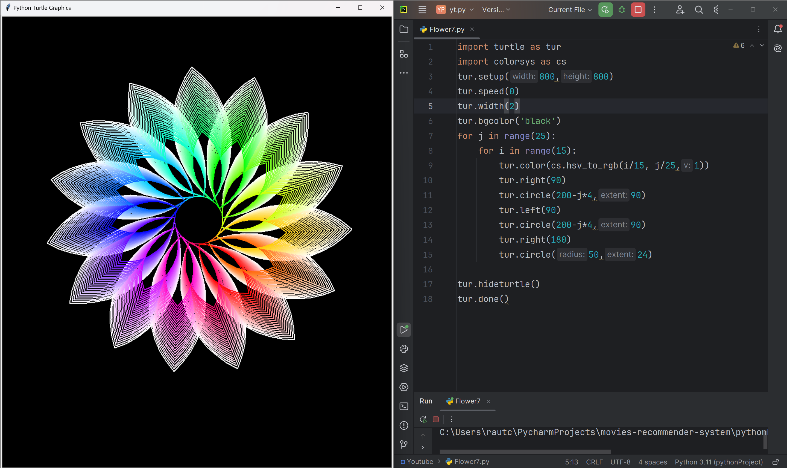

# Aurora Spiral

This code uses the Python Turtle library to create a stunning, spiral pattern that evokes the shimmering colors and ethereal beauty of the Aurora Borealis (Northern Lights). The pattern is formed by drawing a series of connected circles with decreasing radii, with each circle being drawn in a different color from the HSV color space. The colorsys module is used to convert HSV values to RGB colors, creating a smooth transition between colors.

# Tutorial is available on youtube channel 
click on the link to see :- ([Open in Youtube]())

# Screenshot

Aurora-Spiral

# Features
Shimmering colors: The pattern features a vibrant, shimmering palette of colors that shift smoothly from one hue to the next.
Spiral shape: The circles are drawn in a way that creates a spiral shape, with each circle overlapping the previous one.
Intricate details: The pattern includes intricate details, such as the small circles drawn at the end of each spiral arm.

# Run
To run this code, save it to a file with a .py extension (e.g., aurora_spirals.py) and execute it using Python (e.g., python aurora_spirals.py). This will launch a window displaying the Aurora Spirals pattern.

# License
This code is licensed under the MIT License. Feel free to modify, distribute, and use it for any purpose.

# snake.coding
We create a project each 4 days with voting on our <a href="https://youtube.com/@snakecoding_12" target="_blank">Youtube</a> channel.
You can vote for upcoming projects on our channel **community** page :wink:

